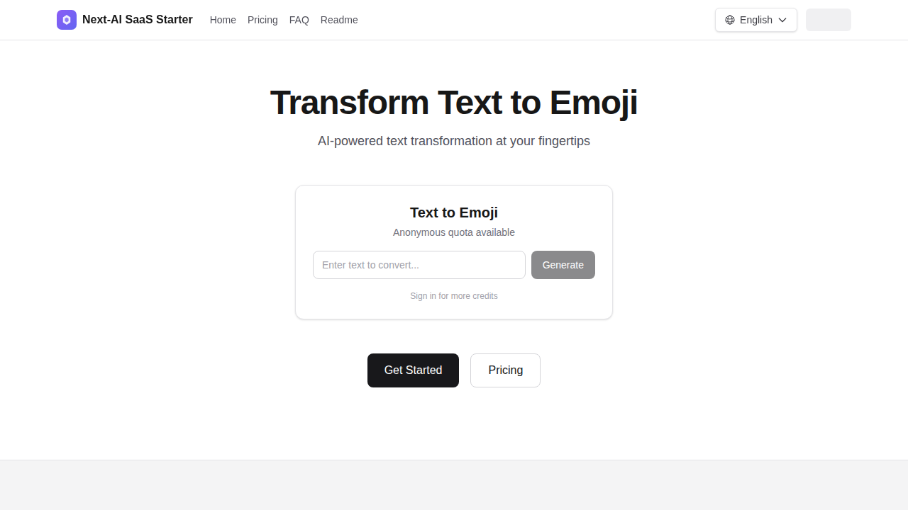
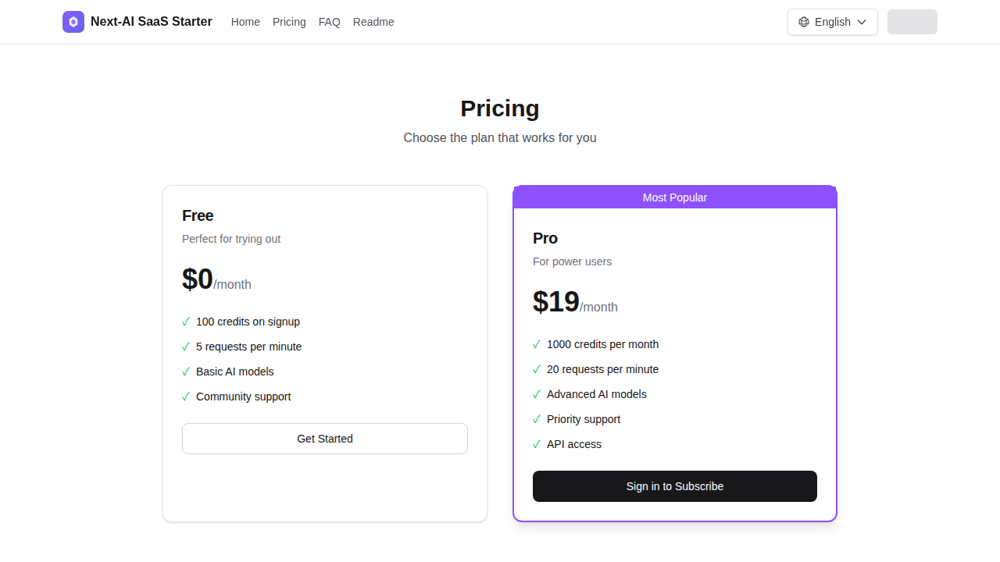

<div align="center">
  
# 🚀 Next-AI SaaS Starter

### 几小时搞定你的 AI SaaS，而不是几周。

专为独立开发者和小团队打造的 **AI 优先** SaaS 模板。  
Next.js 16 · Supabase · Tailwind CSS · TypeScript

[](https://opensource.org/licenses/MIT)
[](https://nextjs.org/)
[](https://supabase.com/)
[](https://tailwindcss.com/)
[](https://www.typescriptlang.org/)
[](https://github.com/kunflow/saastarter/stargazers)

[**在线演示**](https://saastarter.profilelift.pro) · [**获取 Pro 版**](https://kunflow.gumroad.com/l/saastarter-pro/LAUNCH20) · [**文档**](./docs/) · [English](./README.md)


</div>

---

## ⭐ 为什么选择 Next-AI SaaS Starter？

别再从零搭建认证、计费和 AI 基础设施了。**Next-AI SaaS Starter** 提供生产级的基础架构，让你专注于产品本身的核心价值。

> **💡 已被众多独立开发者和小团队用于快速上线 AI 产品。**

### 📊 竞品对比

| 特性 | Next-AI SaaS Starter | ShipFast ($199) | Makerkit ($249) |
|------|---------------------|-----------------|-----------------|
| 开源版价格 | **免费 (MIT)** | $199 | $249 |
| Pro 版价格 | **$49.50** | $199 | $249 |
| AI Gateway（多模型网关） | ✅ | ❌ | ❌ |
| Credits 积分系统 | ✅ 金融级精度 | ❌ | 基础版 |
| Next.js 版本 | 16（最新） | 14 | 15 |
| 数据库 | Supabase | Supabase | Supabase/Firebase |
| Stripe 订阅管理 | ✅ 站内管理 | ✅ 跳转 Portal | ✅ 跳转 Portal |
| 多语言 (i18n) | ✅ 内置 | ❌ | ✅ |

<div align="center">
  
  <br/><br/>
  
</div>

---

## ✨ 核心功能

| | 功能 | 说明 |
|---|---|---|
| 🤖 | **AI 流式输出** | 基于 Server-Sent Events 的实时流式响应 |
| 💰 | **积分系统** | 用量追踪、余额管理、交易流水 |
| 🔐 | **开箱即用的认证** | 登录、注册、会话管理，基于 Supabase Auth |
| 💳 | **计费架构** | Free/Pro 方案与权限映射 |
| 🛡️ | **滥用防护** | 速率限制、匿名配额、成本防护 |
| 🌍 | **多语言支持** | 内置中英文，轻松扩展其他语言 |
| 🔍 | **SEO 优化** | 动态 Sitemap、robots.txt、OpenGraph 元数据 |
| 🎨 | **零代码品牌定制** | 通过环境变量配置所有品牌信息 |
| 📱 | **响应式 UI** | 基于 Tailwind CSS 的移动优先设计 |
| ⚡ | **Next.js 16** | 最新 App Router + React 19 + Turbopack |

---

## 🆓 开源版 vs 💎 Pro 版

| 功能 | 开源版 | Pro 版 |
|:--------|:----------:|:---:|
| Next.js 16 App Router 架构 | ✅ | ✅ |
| Supabase 认证集成 | ✅ | ✅ |
| 数据库 Schema 与迁移 | ✅ | ✅ |
| UI 组件库 | ✅ | ✅ |
| i18n 多语言系统 | ✅ | ✅ |
| SEO（Sitemap、Robots、Metadata） | ✅ | ✅ |
| AI 服务商集成 | 🔸 演示模式 | ✅ OpenAI / Anthropic |
| 积分系统（完整扣费） | 🔸 已跳过 | ✅ 完整实现 |
| 支付集成 | ❌ | ✅ Stripe / LemonSqueezy |
| AI Gateway（多服务商） | ❌ | ✅ 内置 |
| 技术支持 | 社区 | ⚡ 优先响应 |

<div align="center">

**想要完整的生产级体验？**

[🛒 **获取 Pro 版 →**](https://kunflow.gumroad.com/l/saastarter-pro/LAUNCH20)

🎉 **限时特惠：使用折扣码 `LAUNCH20` 立享 50% OFF！**

</div>

---

## 🚀 快速开始（10 分钟）

### 前置条件

- **Node.js** 18+ &nbsp;·&nbsp; **pnpm** 9+ &nbsp;·&nbsp; **Supabase** 账号（[免费版](https://supabase.com/)即可）

### 1️⃣ 克隆 & 安装

```bash
git clone https://github.com/kunflow/saastarter.git my-saas
cd my-saas
pnpm install
```

### 2️⃣ 配置环境变量

```bash
cp .env.example .env
```

编辑 `.env` 文件：

```env
# Supabase（演示模式可保持默认值）
NEXT_PUBLIC_SUPABASE_URL=https://your-project.supabase.co
NEXT_PUBLIC_SUPABASE_PUBLISHABLE_DEFAULT_KEY=your-anon-key
SUPABASE_SERVICE_ROLE_KEY=your-service-role-key

# 品牌定制 — 打造你自己的产品！
NEXT_PUBLIC_APP_NAME=你的产品名称
NEXT_PUBLIC_APP_LOGO=🚀
NEXT_PUBLIC_APP_TAGLINE=你的产品标语
```

### 3️⃣ 初始化数据库

在 Supabase SQL Editor 中按顺序执行以下迁移文件：

```
database/supabase/migrations/
├── 20260204100001_create_enums.sql
├── 20260204100002_create_config_tables.sql
├── 20260204100003_create_user_tables.sql
├── 20260204100004_create_ledger_tables.sql
├── 20260204100005_create_triggers.sql
├── 20260204100006_create_functions.sql
├── 20260204100007_create_rls_policies.sql
└── 20260204100008_seed_initial_data.sql
```

### 4️⃣ 启动

```bash
pnpm dev
```

打开 [http://localhost:3000](http://localhost:3000) — 你的 AI SaaS 已经跑起来了！🎉

### 5️⃣ 体验完整流程

1. **注册账号** → 创建一个新账户
2. **试用 Demo** → 体验 Text-to-Emoji AI 功能
3. **观察流式输出** → 查看实时 AI 响应
4. **查看积分** → 使用后余额自动扣减
5. **仪表盘** → 查看账户状态

---

## 🏗️ 项目结构

```
src/
├── app/                    # Next.js App Router
│   ├── [locale]/          # 基于语言的路由 (en, zh)
│   │   ├── (auth)/        # 登录、注册页面
│   │   ├── (marketing)/   # 定价、FAQ、法律条款
│   │   └── dashboard/     # 用户仪表盘
│   └── api/               # API 路由
├── components/            # React 组件
├── config/                # 配置文件
│   ├── site.ts           # 站点 & 品牌配置
│   ├── seo.ts            # SEO & 元数据
│   ├── credits.ts        # 积分 & 用量规则
│   └── plans.ts          # 订阅方案
└── lib/                   # 工具库
    ├── supabase/         # Supabase 客户端
    ├── ai/               # AI Gateway
    └── i18n/             # 国际化

messages/                  # 翻译文件 (en.json, zh.json)
database/                  # SQL 迁移 & Schema
docs/                      # 文档
```

---

## 🌐 国际化 (i18n)

| 模式 | 配置 | URL 格式 |
|------|--------|----------------|
| 单语言 | `NEXT_PUBLIC_I18N_ENABLED=false` | `/pricing` |
| 多语言 | `NEXT_PUBLIC_I18N_ENABLED=true` | `/en/pricing`、`/zh/pricing` |

在 `messages/` 目录下创建翻译文件并更新 i18n 配置即可添加新语言。

---

## 🛠️ 技术栈

| 类别 | 技术 |
|----------|-----------|
| **框架** | [Next.js 16](https://nextjs.org/)（App Router + Turbopack） |
| **认证 & 数据库** | [Supabase](https://supabase.com/)（PostgreSQL + Auth + RLS） |
| **样式** | [Tailwind CSS 4](https://tailwindcss.com/) |
| **语言** | [TypeScript 5](https://www.typescriptlang.org/) |
| **国际化** | [next-intl](https://next-intl-docs.vercel.app/) |
| **校验** | [Zod 4](https://zod.dev/) |
| **部署** | [Vercel](https://vercel.com/)（推荐） |

---

## 📖 文档

| 指南 | 说明 |
|------|------|
| [个性化定制](./docs/MAKE-IT-YOURS.md) | 自定义品牌、配色和内容（约 2 小时） |
| [环境变量](./docs/env-variables.md) | 完整配置参考 |
| [运维指南](./docs/OPERATING-GUIDE.md) | 生产环境部署最佳实践 |
| [许可协议](./docs/LICENSING.md) | 许可条款与使用权限 |

---

## 🤝 参与贡献

我们欢迎各种形式的贡献！无论是 Bug 修复、新功能还是文档改进，都非常欢迎。

提交 PR 前请先阅读 [**贡献指南**](./CONTRIBUTING.md)。

1. Fork 本仓库
2. 创建功能分支（`git checkout -b feature/amazing-feature`）
3. 提交更改（`git commit -m 'feat: add amazing feature'`）
4. 推送分支（`git push origin feature/amazing-feature`）
5. 发起 Pull Request

---

## 📄 开源协议

本项目基于 **MIT 协议** 开源 — 详见 [LICENSE](./LICENSE) 文件。

可自由用于个人和商业项目。感谢署名，但不强制要求。

---

<div align="center">

## ⭐ 给个 Star 吧

如果这个项目对你有帮助，**请给个 Star 支持一下！**  
这能帮助更多人发现它，也是我们持续改进的动力。

[](https://star-history.com/#kunflow/saastarter&Date)

**[⭐ GitHub Star](https://github.com/kunflow/saastarter)** &nbsp;·&nbsp; **[🛒 获取 Pro 版](https://kunflow.gumroad.com/l/saastarter-pro/LAUNCH20)** &nbsp;·&nbsp; **[🌐 在线演示](https://saastarter.profilelift.pro)**

---

由 [Kunflow](https://github.com/kunflow) 用 ❤️ 打造

</div>
